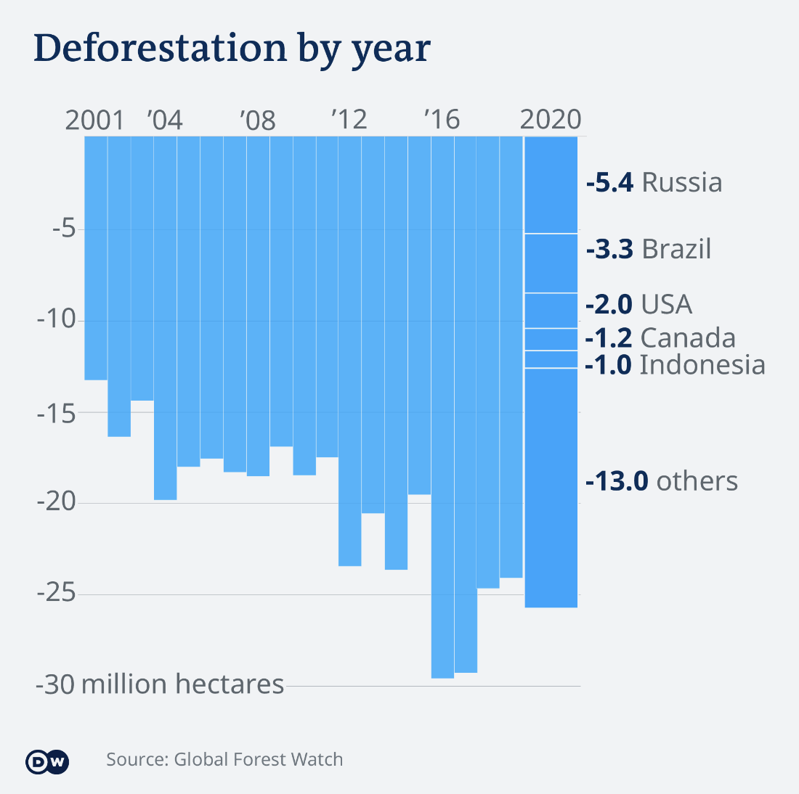

| [home page](https://gabriellediraddo.github.io/tswd-portfolio) | [visualizing debt](visualizing-government-debt) | [critique by design](critique-by-design) | [final project I](final-project-part-one) | [final project II](final-project-part-two) | [final project III](final-project-part-three) |

# Critique By Design

Six hours of scrolling through smart, informative, clear data visualizations later, I came across the following graphic [in an article](https://www.dw.com/en/climate-change-emissions-data-charts-cop26/a-59652069) about climate change and what questions and answers world leaders might want to know when discussing its global impact. This graphic was nestled under the question: "What are the major sources of greenhouse gas emmissions?" and considers which countries have been the world's biggest drivers of deforestation. 

## The Critique

I critiqued the visualization using Stephen Few's Data Visualization Effectiveness Profile, ranking the following on a scale of 1-10

### Usefulness. Is it useful for the intended audience?  Does it communicate valuable information?
6 - This chart identifies which countries committed the most deforestation in 2020, but not historically. I think there could be added value if the country breakdown applied to every year it was clearer to understand the trends of each country. The graph also doesn’t say a lot about how the deforestation is occurring - is it due to wildfires? Agriculture?

### Completeness.  Does the visualization have everything necessary to make it understandable?
8 - Necessary information is present, but I would argue that it would feel more complete if the country breakdown was applied to each year. I think that the y axis would feel more complete if each number tick was presented with a unit in millions.

###Perceptibility.  Can the reader understand the information with minimal effort? Is the visualization type appropriate?  Does it use illogical comparisons?
7 - The graphic doesn’t have a lot of complexity and it’s easy to understand once you realize that it’s flipped. The blue does not make it easy to understand that each country is different. The bar graph makes sense in this situation.

###Truthfulness.  Is the visualization accurate, reliable and valid?  Is it representing what it says it is, and in the most complete and truthful manner? Does it misrepresent the data or make comparisions that aren't correct?
7 - I am taking points off for the final bar being much wider and appearing as if this slowdown period has been going on for longer than it actually has been. Because “others” accounts for the majority of deforestation, it draws my attention there and makes me wonder what countries are included, which sows doubt about the trustworthiness of the chart’s creator. 

###Intuitiveness.  Is it easy to understand and clearly communicates the information?  If unfamiliar, does it include easy to understand instructions on how to interpret it?
7 - It takes me a moment to understand that the numbers relate to forest loss which is why the chart appears upside down. It’s not intuitive to understand the countries as distinct variables in 2020 because they are all the same color. I think I intuit the bars to be the other way because loss is implied with the word deforestation. 

###Aesthetics.  It is interesting / enjoyable to look at?  Is it a good example of what a beautiful data visualization might look like?  Is it somewhere in the middle - pleasing but otherwise not distracting to look at?
7 - It’s very minimal and not at all overwhelming - in fact, to its detriment. There is a lack of white space between bars. Without color variations where there probably should be, the chart looks too homogenous. 

###Engagement.  Does it lead the audience to learn more about the topic?  Does it inspire the audience to talk about the data or share it with others?

3 - The chart does not instill an emotional connection - it’s difficult to comprehend how big 30 million hectares is. The takeaway presented seems miniscule. Deforestation has slowed down, but that still seems like a lot per year! 

###Summary 
Overall, I think the minimalism makes the chart approachable and easy. The upside down orientation is not very intuitive. The chart feels like a flat blue wall where little is emphasized - the bars need some white space breathing room and each country should be represented with its own color. I think that breaking down the information by country is useful and should be extended to each year. It was strange to isolate it to 2020 alone. I think that communicating how big a land area 30 million hectares is would be more engaging, and maybe this necessitates playing with scale. I would change the color scheme to green to trigger the biological connection to nature and create a gradient for the countries to distinguish the variables.

As stated in the article, the primary audience for the tool was world leaders - or at least, climate change decision makers who want to understand what contributes to climate change before making a decision on what to do about it. I think that the chart relies on the assumption that the audience relates increased deforestation to climate change, which I think is a safe assumption to make. The chart somewhat imparts the negative impact of deforestation with the upside down orientation. I think that the simplicity would appeal to this audience who may not have a lot of time to spend on a chart and must understand the information presented quickly. 

##Sketching a Solution

![Deforestation by year chart redesign v1] (DeforestationChartRedesignV1.jpeg)
I chose to make my first redesign by hand. I changed the y-axis orientation to represent tree loss with a positive value, which is more intuitive to me. I also added the Millions unit to each number to help emphasize how big a land mass this graph represents. I liked that not every year was written on the x axis, so I maintained this minimal axis design on my chart. 

For this version, I wanted to experiment with a stacked area chart because I wanted to show trends over time and I thought it would help psychologically associate the data with real land mass and make it feel relevant and personal. I chose a green color palette and gave each country a different gradient, which was challenging with a limited colored pencil collection. I also extended the country breakdown to be present for every year. 

I changed the title to include the phrase “tree coverage loss” to move away from assumptions the audience may have about what qualifies as “deforestation”. Trying to write a title drew my attention to the usefulness of the graph, or lack thereof. I am unsure if the solutions I chose to address with this draft address an underlying issue from the critique - what is this graph really trying to say, and is this useful to its audience? 

##User Feedback

###In-class Peer Critique

After asking peers questions about my redesign, I received the following feedback:

* The point of the graph was not easy to understand from the title. It’s more descriptive of what is on the graph than what the graph is saying.
* The green feels too positive, tree loss isn’t a good thing and this big area of bright green made the viewer think at a quick glance that this is a very positive chart.
* Maybe there’s too much data for there to be a simple takeaway. Variables might need to be isolated, maybe pre- and post-pandemic or something else time related.
* It is difficult to see any measurements, and there was a desire to use a grid or some other system that made it easier to see more precise numbers

###User Feedback

To learn more about how viewers experience and understand my redesign without the context of the original data visualization, I conducted user feedback sessions asking the following questions. The I gathered user feedback from

1. Female, student, 30's
2.  Female, retired, 60's

**Can you tell me what you think this is?** 
It tells me how much tree cover loss is concentrated within the five countries identified in the label, and the conglomerate of all other countries. 
This is how many trees were cut down in these countries from 2001 to 2021 in hectares. Other is a bunch of countries. 

**Can you describe to me what this is telling you?** That we’re losing a lot of trees, and that this is the amount of trees that are being cut down, but maybe it includes trees lost due to natural disasters, I’m not sure, and it's increasing as time goes on. And if you think about it, it's scarier because with every tree we lose, the next tree we lose is even more precious because we have fewer of them. This makes me feel panicked because climate change makes me feel panicked. 
The first thing that occurs to me is that Russia lost a whole bunch of trees in 2015, and then I look at it and I’m not sure what I’m looking at. I don’t like this kind of graph. Russia is the worst, and everything else has gone out. We should be very panicked about how many trees we have lost. 

**Is there anything you find surprising or confusing?**
I’m trying to imagine Indonesia and how big it is. It’s so small. The other countries have a large land mass, so it’s surprising that it's on the list because it's not as big as the other countries, so maybe its more forested. I don’t know how much a hectare is but I bet its a ton. The “other” is complicated, like is it literally every other country in the world? Is the area of the line inclusive? It’s hard to see what the total is. Is Russia losing 25 million hectares or just 10?
I don’t know how big a hectare is - is M miles? I don’t know that. I’m confused by Russia. I’m really surprised because when I read stuff, it says that the US and Canada have had horrific fires and we’ve lost acres and acres of forest from global warming. We know that Brazil is burning trees as fast as possible. But I’m surprised about Russia and I don’t know why they’re losing trees, but to what? It’s intriguing, but I dont know why they are - is it deforestation, is it climate, is it disease?

**Is there anything you feel like is missing or you would like to see?**
It might be interesting to see some numbers, like is 50% of the tree loss made up by other countries? Having the land mass might be interesting. Including the percentages for each of the years for each country, too. 
I dont like that the colors are so close together, it makes it hard to distinguish one from the next. Otherwise, no. 

## Final Redesign

Using the original data source from [Global Forest Watch's Dashboard] (https://www.globalforestwatch.org/), I used Tableau to create another redesign with these perspectives in mind. 

! [Deforestation Chart Redesign V2]

