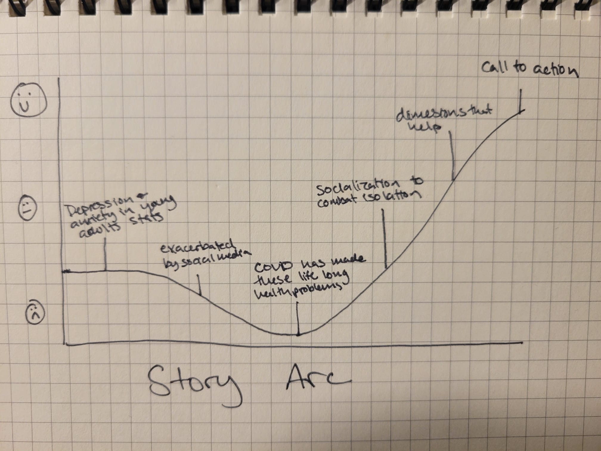

| [home page](https://cmustudent.github.io/tswd-portfolio-templates/) | [visualizing debt](visualizing-government-debt) | [critique by design](critique-by-design) | [final project I](final-project-part-one) | [final project II](final-project-part-two) | [final project III](final-project-part-three) |

# Final Project Part 1 

## Story Outline
Young adults are increasingly at risk for depression and anxiety. These mental health conditions were exacerbated by COVID-19 pandemic lockdowns. Isolation and loneliness may have lifelong impacts as the pandemic occurred in key social development years. Social interventions targeted toward addressing isolation could help address 

Through these data visualizations, I want to tell a story about why young adults are more at risk for depression and anxiety due to these unique challenges and how severe the problem is. While my initial wave of research did not provide data sets on what remedies help young adults facing these health conditions, my story will ultimately provide calls to action that address this health concern. 

**Story Arc**

**One sentence summary of your story:**
Facing extreme isolation during key developmental years, due to COVID-19 and the rise of social media, has led to major increases in anxiety and depression for young adults. 

**What should your reader understand after reading your story?**
As a viewer, I want to understand why young adults are more at risk for these health conditions so that I can advocate for mental health resources and interventions.

**Personas:** 
Parent: give my young adult more opportunities and space to socialize
Policy Maker: create more public spaces for young adults to socialize in, like parks
Young adult: use my social media networks to engage in socialization and not just passively scrolling

### Major Sections and Initial Sketches

Young Adults facing anxiety and depression

Lasting Impact of COVID-19

Increased isolation/how socialization can help

Calls to action

## Data Sources
[When loneliness dimensions drift apart: Emotional, social and physical loneliness during the COVID-19 lockdown and its associations with age, personality, stress and well-being](https://onlinelibrary-wiley-com.cmu.idm.oclc.org/doi/full/10.1002/ijop.12772) This reseach represents isolation as three dimensions and provides data on how different stressors from the pandemic lockdown impacted isolation. I will use this data in part to help define isolation as physical, social, and emotional isolation, which will help to guide how different calls to action may impact different dimensions of isolation. This data will also visualize how different traits or environments impact isolation, including age, living arragement, and extraversion. 

[Social Support](https://data.oecd.org/healthrisk/social-support.htm) This data shows what percentage of people report having someone in their life that they can count on in times of trouble. The raw data includes breakdowns for age, gender, and country for the years 2009-2021. I will use this data to show the pandemic has increased isolation for young adults. 

[American Trends Panel Wave 83](https://www.pewresearch.org/science/dataset/american-trends-panel-wave-83/) This dataset includes data on distress levels for young adults vs US adults two years after initial COVID-190 lockdowns. This will be used to create the graph titled "Young Adults are still experiencing high levels of distress, two years after lockdowns begin"

[2021 National Survey on Drug Use and Health: Detailed Tables](https://www.samhsa.gov/data/sites/default/files/reports/rpt39441/NSDUHDetailedTabs2021/NSDUHDetailedTabs2021/NSDUHDetailedTabs2021.pdf) I will be using the table on page 1100 to create the bar graph visualization that illustrates how many more young adults experienced a depressive episode in 2021 compared to other age brackets.

[Pain in the Nation](https://www.tfah.org/wp-content/uploads/2022/05/TFAH_2022_PainIntheNation_Fnl.pdf) Includes data regarding suicide rates in the past decade for various age groups, which will be used to create a data visualization for the increase in suicide rates among young adults.

## Method and Medium

I will be using Shorthand to build my story. To create the data visualizations, I anticipate using Tableau for charts and graphs and Canva for text-focused visualizations. This story will be visible and shareable via this Github Repository.