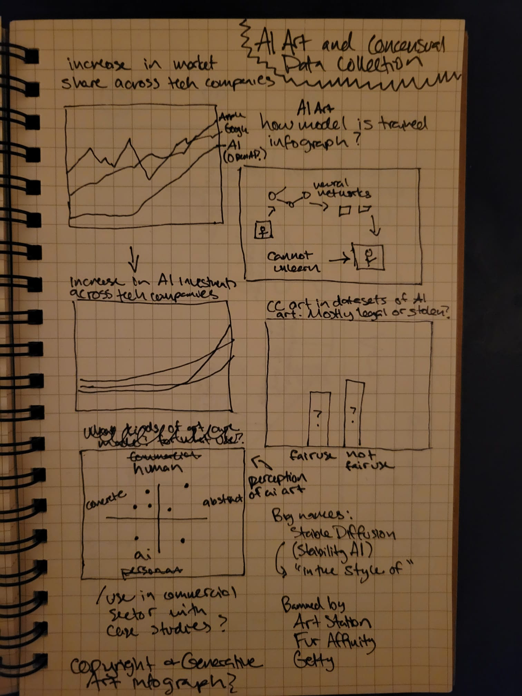
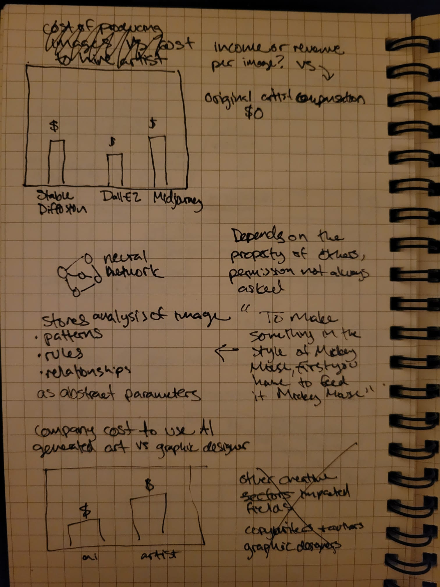
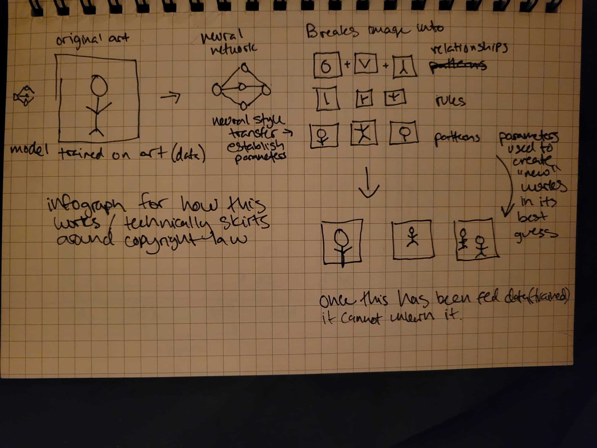
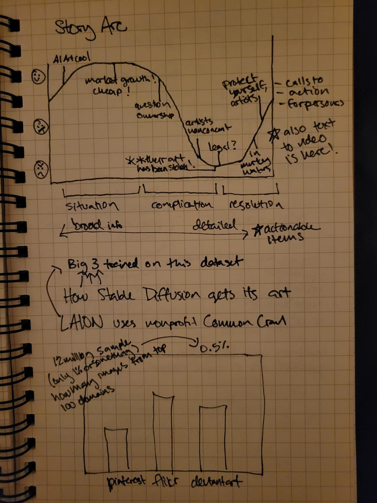
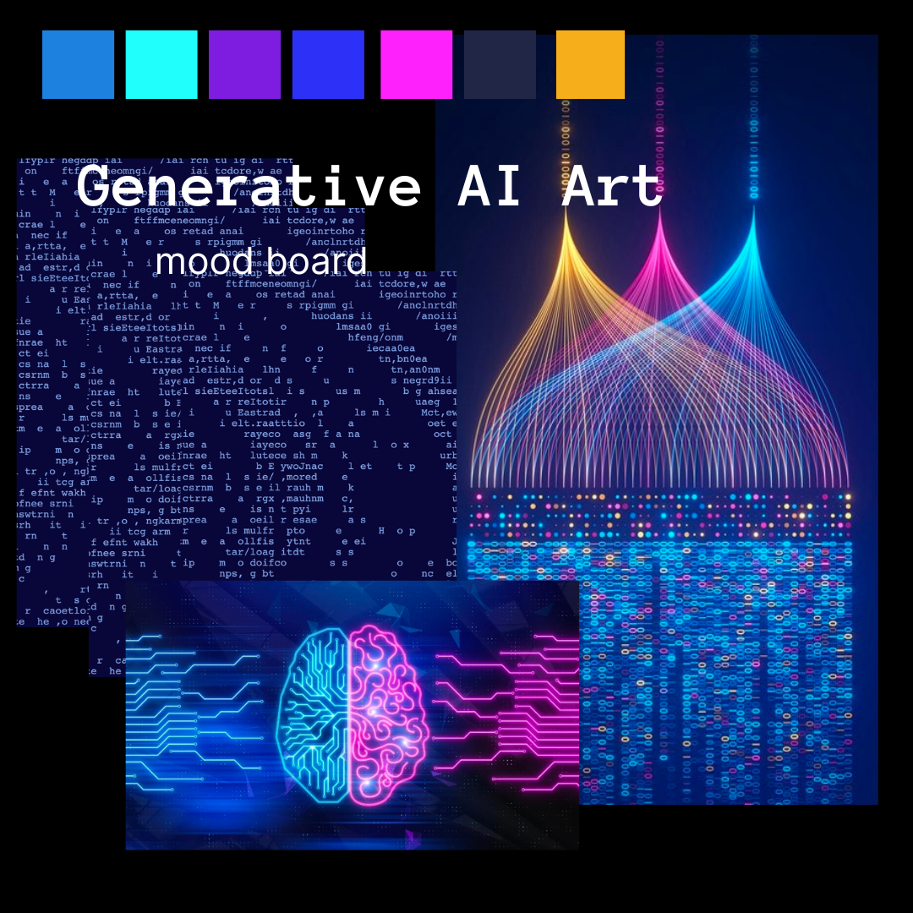

| [home page](https://cmustudent.github.io/tswd-portfolio-templates/) | [visualizing debt](visualizing-government-debt) | [critique by design](critique-by-design) | [final project I](final-project-part-one) | [final project II](final-project-part-two) | [final project III](final-project-part-three) |

# Part 2: Wireframing, storyboarding, and user feedback

### Foreward
This week, I started fresh with a new idea that I am more interested exploring. Here are some initial sketches I made while researching. 

## Wireframe
After sketching, I went straight to wireframing on Shorthand and created high fidelity data visualizations on figma. 
https://preview.shorthand.com/dbJ3KA8o2W7xVi9M 

## User Research

### In-class Feedback

Feedback from my peers focused on the pursuasive elements of the narrative, and how the visualizations and information presented could have more impact. My peers also zeroed in on a few of the graphs that were the most confusing to them, identified below for further user research feedback. 
- I want to know more about how artists feel and how this has impacted them personally
- It seems important that this is legal and undoable and that was kind of glazed over
- The first graph could use an animation, the point of it gets lost
- Clarity on that the neural networks are trained on huge data sets, it needs to come back around to the artists

### Target audiences

**Living artists** who have posted their work on the internet. Their work may already be included in a data set used to train generative AI models, and they should be aware that they can express consent/nonconsent. If not, artwork posted in the future could be scrape to train on models on their technique, so they should be persuaded to take actions to protect their IP. 

**Business owners/marketers** who are currently using or considering using generative art AI platforms for commercial use. This story should bring awareness to those who are unaware of the legal gray area surrounding copyright law and artist consent, and it should persuade them to work the technology responsibly. 

**Generative AI developers** who have a say in what data sets are used to train and maybe how the platforms are operated. This target audience is the decision maker who should be pursuaded to use copyright free images and make past data sets publicly available.

I tried to pick three users who generally fit into the three user personas of the target audience (although none were exaactly the target audience)

- User A: male, 30's, full stack software developer
- User B: female, 60's, business owner and former artist
- User C: female, 30's, arts management student

### Interview Script

| Goal | Questions |
|------|-----------|
|Identify any pain points, challenges, or barriers to understanding the story and supporting visuals | What did you want to learn more about? |
| | Was there anything that confused you? | 
| | Did anything feel missing or incomplete? | 
| Learn how easy or difficult it is for viewers to understand graphics quickly, in particular ones identified as challenging during in-class feedback: Google Trends, identifying AI-made art, infographic, tree map | What did you notice first about X graphic? | 
| | Can you tell me what you took away from X graphic? |
| | Where do you think you spent the most time when looking at X graphic? |
Understand if the narrative structure is persuasive and convincing | What moment was the most impactful? |
| | Where did you start to get bored or think about other things? | 
| | Is there anything you would do differently when interacting with generative art AI  now that you’ve seen this? | 

## Interview Findings

| Questions  | User A      | User B      | User C    |
|----------------|-------|-------------|-------------|
| What did you want to learn more about? | Are there any plans to fix this? Does anyone know about this? Has it been mentioned to Congressional people because of the severity of it. And the graphs should all be viewable on a single screen, I don't want to scroll. | What the laws are protecting me and are there any. | What is the going rate for artists for a commission these days? |
| Was there anything that confused you? | I don’t really see how I can help as a developer, I’m not art adjacent at all. Maybe as a general, we should be aware of the problem, because I’m sure this exists not just in art but ChatGPT and authors probably have the same. | No | I wanted to know more about how the survey was done. |
| Did anything feel missing or incomplete? | It ended weakly that it can’t be untrained. Maybe a sentence about why, that's important. | No only that I needed some clarification about what is digital art versus just regular art. | Yeah, the things I was curious about. The average salary of a graphic designer. Oh, and I guess how many images can be made in an hour on a platform. That leads me down a rabbit hole of whats the standard request that someone would have and how many images would they make and how many images could you make? |
| What did you notice first about the Google Trends graphic? | The trend, more popular. I guess I don’t know what 100 means | How quickly interest has risen, in one year, less than a year | The labels of the names|
| Can you tell me what you took away from the Google Trends graphic? | Makes the think of ChatGPT, that consumer models are getting more use| That I wish I had MidJourney stock. I’m really kind of surprised that there are only three major companies| I was surprised that MidJourney was more prominent than Dall-E|
| Where do you think you spent the most time when looking at this graphic? | The names of them. When I first saw this, I thought the only one I had heard of was Dall-E because the name is so great.| The peaks, the names | Where the lines intersect the most, its the most visually interesting|
| What did you notice first about AI-made art graphic? | The colors threw me a bit, they’re kind of opposites so they should contrast more. Blue is good? Brown is bad? Like they were tricked? | Were all of these objects AI generated? That wasn’t clear to me. | The variations, the lack of consistency |
| Can you tell me what you took away from the AI-made art graphic? | As you talked through it, I thought oh double blind is a good way to do that, that was a good choice to illustrate | That people are easily fooled | Questions about the artworks themselves and how the survey was done |
| Where do you think you spent the most time when looking at this graphic? | Probably the legend to get which ones are which and then look back| At the blue | My eyes spend a lot of time moving across, the 50/50 one and the first two were so different|
| What did you notice first about the neural network graphic? | I was paying attention to what you said they did. I was definitely focused on the graphics and listening. | The simplicity, it was clear.  | Did you get this from somewhere else or did you make this?|
| Can you tell me what you took away from the neural network graphic? | A general macro idea of how machines can learn patterns from images, that patterns were the important piece. | I thought this was interesting because I didn’t understand the concept. It’s been in the news recently and I didn’t exactly understand that it’s the idea of the image, so that was interesting to me that that’s how it’s teaching itself.  | I felt like it broke down the steps that solidified ideas that I was aware of but fuzzy  on. It made me confident in my knowledge. |
| Where do you think you spent the most time when looking at this graphic? | The pictures | Is the blue thing with the lines a neural net? | The “best guess” is the most illogical and my brain was trying to make sense of it. And it was the point of the whole infographic, so it felt like the most important. 
 |
| What did you notice first about the tree map? | That wikipedia wasn’t one, I thought for sure it would be there. I liked this one, the shapes make sense. | I think the first thing I looked at was how many of these do I use. Pinterest, WordPress, I dont know Fine Art America. | Pinterest caught my eye|
| Can you tell me what you took away from the tree map? | It’s much more user content generated| Definitely oh wow, look at all the places where I’m looking at images. I guess I had never thought about that, how much imagery is out there and available.  | That I’m just now realizing that the three colors represent categories. I’m not familiar with the websites enough to know that they’re all types of websites. I don’t know what fine art america is. I was surprised that they’re using Getty. |
| Where do you think you spent the most time when looking at this graphic? | Uh, the names of the companies| I wondered if the size of the boxes had anything to do with weighting how many images were taken from the places.  | Pinterest, the top right corner is where our attention goes first anyway, right? 123RF I didn’t know, and everything else is familiar, so that one took me a minute. |
| What moment was the most impactful? | I want to say the title, it was the human aspect. And the call to action. And the fact that this is screwing people over. | The risk that artists have to being fleeced yet again. Are artists ever going to make money for what they create? Creative people are not protected.  | The pairings of the sentence of when you said that copyright is using the idea not the picture. That was a very clarifying moment. And in an interesting and curious way.  |
| Where did you start to get bored or think about other things? | The transition after “1 in 5 artworks” graphic | None | No, it wasn’t very long. |
| Is there anything you would do differently when interacting with generative art AI now that you’ve seen this?| Yeah, I’d treat it with caution. And as an uploader, understand that stuff is getting scraped. | It sure makes me think about what I load into these sites. Do I want those images out there. But it also makes me interested in using it. | Yeah, I was always a little skeeved out and now I feel more justified in my choice to not use them. It’s actually exploiting artists work.  |

## Identified changes for Part 3

| Research synthesis | Anticipated changes for Part III   |
|-------|-----------------|
| Users gravitated towards the legal ramifications of this subject (or rather, lack thereof) | Include current court cases surrounding the subject (Getty vs StabilityAI), include any legislative cases in the system, and try to incorporate this into the calls to action for users for an advocate persona. |
|  There are gaps in knowledge about what the art is and what the technology is.| Include a case study of an artist whose work was stolen to help demonstrate the process and ground the audience in a real world situation. This could also address the in-class feedback to put the artists’ perspective at the forefront to help emotionally persuade the audience.  |
| The Google Trends graphic’s purpose is getting lost, people are fixated on the difference between the companies and the companies themselves | I think that this could be streamlined to have just the Google trends for “ai art generator” or something similar. I workshopped this a bit with peers in class, and to emphasize how recent this spike is, this visualization might work better as an animation to show change over time. I will need to find another way to introduce some of the major companies in this space, which can likely just be done with a few sentences. |
| The AI-made versus human-made graphic is not easy to understand, and people are comparing numbers more than I anticipated. This graphic made people really curious and interested in the topic and generated a lot of questions, but also generated a lot of eye movement.  |  I think that changing this to an infographic instead of a bar chart will help draw people’s attention to the point - 1 in 5 - rather than comparing what people thought. The colors also need to be changed so that there are no “good” or “bad” connotations, just gray and one highlight color.  |
| The neural network graphic is very clear, but the transitions around it are a little weak. | This was a very clarifying moment amongst users and really anchored them into the content. Explaining this gave the user “confidence” even if they weren’t familiar with the topic. This is a pivotal moment in explaining the complication. My next iteration will add on to this graphic two more frames, one to explain that the more images it is trained on, the better the parameters are (so bigger data sets are better) and that neural networks cannot easily be untrained. There also need to be a few labels added, like “parameter” and “neural network”  |
| Users are not very familiar with the tree map visualization and requires a few logical leaps to understand this visualization |  Adding some labels will help lessen the mental load of this visualization for users who are unfamiliar with the format. Names and number of images should be in each square, and adding a color legend might clarify the purpose of domains that are unfamiliar to the user.  |
| Users really like the title|  There’s nothing to change here, I was just surprised. I never asked, and every user made a point to state this.  |

## Moodboard & Personas

